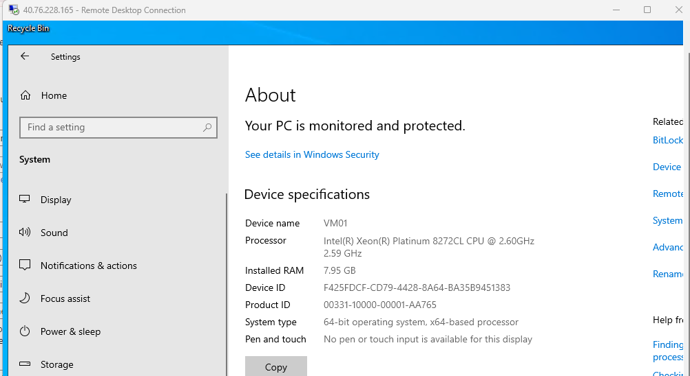
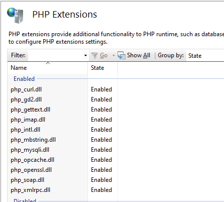

<h2>Environments and Technologies Used</h2>

<h4>Microsoft Azure (Virtual Machines/Compute):</h4>

- Owned by Microsoft- allowed users to create resource group and run various virtual machine suhc as Windows, Ubuntu , Red Hat Enterprise Linux, Windows Server, etc.

<h4>Remote Desktop- RDP Port 3389 </h4>

$\textcolor{blue}{- Used to facilitate remote access to Windows computers through the Remote Desktop Protocol (RDP). 
This connection method allows users to operate a remote desktop or server as if they were physically present, regardless of location. }$

 <h4>Internet Information Services (IIS) </h4>

- Internet Information Services is an extensible web server created by Microsoft for use with the Windows NT family.

- Part of the lab - we added:
    - PHP Manager
        - Extensions :
        
    - CGI
    - URL Rewrite
    

<h2>Operating Systems Used </h2>

-Windows (Windows 10 Pro)

<h2>List of Prerequisites</h2>

- IIS and Management Console
- PHP and Rewrite Module
- MySQL
- HeidiSQL
- osTicket
