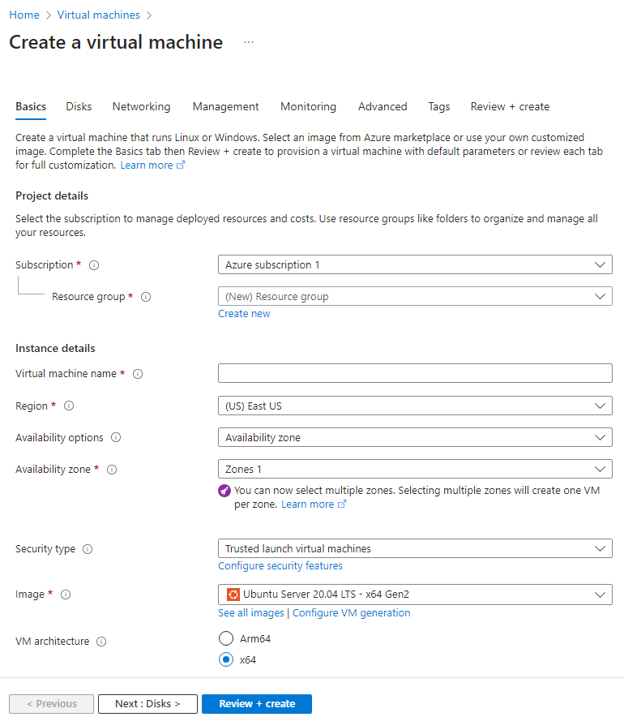

<h2>Environments and Technologies Used</h2>

- Microsoft Azure (Virtual Machines/Compute): Owned by Microsoft- allowed users to create resource group and run various virtual machine suhc as Windows, Ubuntu , Red Hat Enterprise Linux, Windows Server, etc.
- Remote Desktop- RDP Port 3389 - Remote -  Used to facilitate remote access to Windows computers through the Remote Desktop Protocol (RDP). This connection method allows users to operate a remote desktop or server as if they were physically present, regardless of location.
- Internet Information Services (IIS) - Internet Information Services is an extensible web server created by Microsoft for use with the Windows NT family.

<h2>Operating Systems Used </h2>

-Windows (Windows 10 Pro)

<h2>List of Prerequisites</h2>

- IIS and Management Console
- PHP and Rewrite Module
- MySQL
- HeidiSQL
- osTicket
