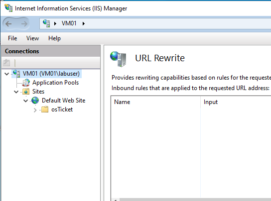
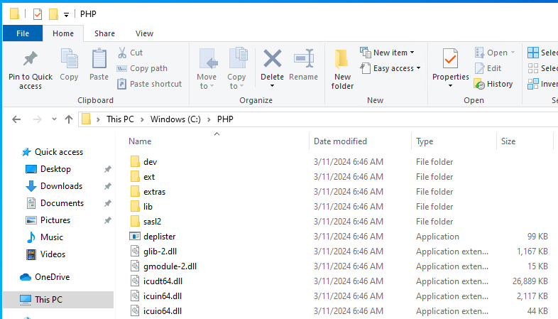
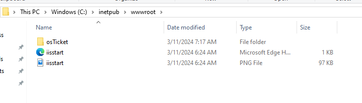
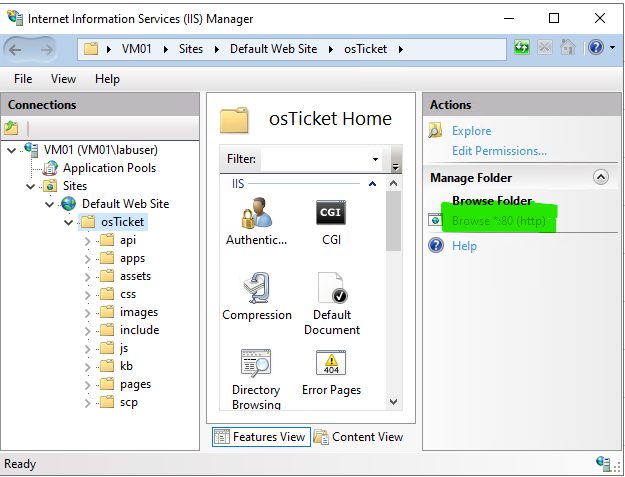

<h2>Environments and Technologies Used</h2>

<h4>Microsoft Azure (Virtual Machines/Compute):</h4>

- Owned by Microsoft- allowed users to create resource group and run various virtual machine suhc as Windows, Ubuntu , Red Hat Enterprise Linux, Windows Server, etc.

<h4>Remote Desktop- RDP Port 3389 </h4>

- 
 Used to facilitate remote access to Windows computers through the Remote Desktop Protocol (RDP). This connection method allows users to operate a remote desktop or server as if they were physically present, regardless of location. 

 <h4>Internet Information Services (IIS) </h4>

- Internet Information Services is an extensible web server created by Microsoft for use with the Windows NT family.

- Part of the lab - we added:
    - PHP Manager
        - Extensions :
        

    - URL Rewrite
        
        

    - HeidiSQL
        
         

    - osTicket

     
        

    

<h2>Operating Systems Used </h2>

-Windows (Windows 10 Pro)

<h2>List of Prerequisites</h2>

- IIS and Management Console
- PHP and Rewrite Module
- MySQL
- HeidiSQL
- osTicket

## Installation Steps:

<h4>Step One: Install/Enable IIS in Windows with CGI</h4>
<ol>
    <li>Control Panel</li>
    <li>Programs</li>
    <li>Turn Windows features off or on</li>
    <li>Check the box</li>  
    
    <li>Test the page- 127.0.0.1  (Loopback)</li>
     
     

</ol>
 
<h4>Step Two: Install PHP Manager for CGI</h4>
<ol>
    <li>Download and Install - <a href="https://drive.google.com/file/d/1RHsNd4eWIOwaNpj3JW4vzzmzNUH86wY_/view" target="_blank">Php Manager</a> </li>
</ol>

 
<h4>Step Three: Install Rewrite Module</h4>
<ol>
    <li>Download and Install - <a href="https://drive.google.com/file/d/1tIK9GZBKj1JyUP87eewxgdNqn9pZmVmY/view" target="_blank">Rewrite Module</a> </li>
</ol>

 
<h4>Step Four: Create Folder in C: Drive</h4>
<ol>
    <li>Create PHP folder in ROOT -   
      
      </li>
    <li>Download and Install - <a href="https://drive.google.com/file/d/1snNMtLdCOpMtkCyD4mvl9yOOmvVIp9fP/view" target="_blank">PHP 7.3.8 </a></li>
    <li>Extract file to PHP folder in ROOT</li>
     
      </li>
</ol>

 
<h4>Step Five: Install C++ Redistributable</h4>
<ol>
    <li>Download and Install  - <a href="https://drive.google.com/file/d/1s1OsGF3-ioO0_9LYizPRiVuIkb3lFJgH/view" target="_blank">C++ Redistributable File </a> </li>
</ol>
 
<h4>Step Six: Install MySQL </h4>
<ol>
    <li>Download and Install  - <a href="https://drive.google.com/file/d/1_OWh9p7VQLcrB0q_V7qT8yHl0xo5gv7z/view" target="_blank">MySQL </a> </li>
    <li>Note: Make sure to Write Down ROOT password.</li>
     <li>Then Next and Finished</li>
</ol>

 
<h4>Step Seventh: Configuration inside IIS </h4>
<ol>
    <li>Search IIS on your PC </li>
    <li>PHP Manager</li>
    <li>Register new PHP version
        <li>Browse: click on the three dots</li></li>
        <li>C: Dive</li>
        <li>PHP folder</li>
        <li>php-cgi</li>
        <li>Restart IIS 
          
        </li>
        </li>
</ol>
 
<h4>Step Eight: Install osTicket </h4>
<ol>
    <li>Download osTicket Zip and Extract - <a href="https://drive.google.com/drive/folders/1APMfNyfNzcxZC6EzdaNfdZsUwxWYChf6" target="_blank">MySQL </a></li>
    <li>Rename "Upload" to "osTicket":   
     </li>
</ol>

 
<h4>Step Nine: Test osTicket </h4>
<ol>
    <li>In IIS</li>
    <li>Click Browse: .80 </li>
       
        </li>
   <li>Page should load - If not you need to restart the lab  from Step Eight </li>
   
</ol>
 
<h4>Step Ten: Enable Extension</h4>
<ol>
    <li>Go to IIS, Site ==> Default ==> osTicket </li>
    <li>Go PHP Manager  ==> Enable these extension:
    <li>Enable: php_imap.dll</li>
    <li>Enable: php_intl.dll</li>
    <li>Enable: php_opache.dll</li>
    </li>
    <li>Refresh </li>

</ol>

 2. </li>
 3.  </li>

 
<h4>Step Eleven: Rename</h4>
    <li>Path: C:\inetpub\wwwroot\osTicket\include</li>
    <li> Rename from "ost-sampleconfig.php" ==> "ost-config.php" </li>
  
  </li>

   
<h4>Step Twelve: Set Permission to OST file</h4>
    <li>Right Click ost-config.php ==> Properties ==> Security==> Advance ==> Disable Inheritance ==> Remove All Permission </li>
    <li>Click "Add" ==> Select Principle ==> in the box type "Everyone" ==> CHECKED ALL BOXES</li>
    <li>Click Ok twice</li>
  
  </li>

<h4>Step Thirteen: Install HeidiSQL</h4>
    <li>Downlaod and Install- <a href="https://www.google.com/url?q=https://www.heidisql.com/installers/HeidiSQL_12.3.0.6589_Setup.exe&sa=D&source=docs&ust=1710254958363001&usg=AOvVaw0ZYb-ytx6_a5F03O0sjh9U" target="_blank">HeidiSQL </a> </li>
 
  
  </li>

<h4>Step Fourteen: Login with Root Password</h4>
    <li>Open Heidi SQL-
  
  </li>

# Setting up osTicket HelpDesk

  
  </li>
    <li>Fill out everything and Write Down your username and password</li>

<h4>Continue Setting up osTicket in the Browser</h4>

    MySQL Database: osTicket 
    MySQL Username: root 
    MySQL Password: Password1 
    Click “Install Now!” 
   

## Last Step : Delete the the folder called "Setup"

 
<h5>There is no folder call "Setup" </h5>
  </li>

  <h4>Task : Set Permission Back to READ ONLY </h4>
    <li>Right Click ost-config.php ==> Properties ==> Security==> "Everyone"  </li>
    <li>Set EVERYONE TO  Read- Only and Read </li>
    <li>Click Ok twice</li>
  
  </li>

### To Access the osTicket Login page

Congratulations, hopefully it is installed with no errors! 
Browse to your help desk login page: <a href="http://localhost/osTicket/scp/login.php" target="_blank">http://localhost/osTicket/scp/login.php</a>